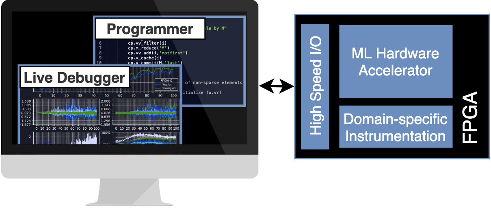

# LeBug

LeBug is an open-source debug instrumentation that allows for the live debugging of machine learning systems during training. Different from previous debug instrumentation, our instrumentation offers firmware programmability, allowing the researcher to gather data in a large variety of ways that would likely not be anticipated at compile time.

The manuscript related to LeBug is to appear at [The 29th IEEE International Symposium On Field-Programmable Custom Computing Machines (FCCM 2021)](https://www.fccm.org/).



## Installing dependencies

### Installing Docker

We use docker to allow testing the RTL generated by LeBug in Mac, Windows or Linux. Note that Docker is **not** needed for generating RTL. You can download docker [here](https://docs.docker.com/get-docker/).

### Testing your installation

- To test the emulator, go into the examples/emu_test directory and run
    ``` 
    python3 emu_test.py
    ```
- To test hardware generation and modelsim, go into the examples/hw_test directory and run
    ``` 
    python3 hw_test.py
    ```
    
    Please note that running this script for the first time might take a while, since Docker will automatically download the Modelsim container for testing hardware components.
## Getting Started

### Configuring a new example

Each example is composed of those main files:

- Config.yaml file
  - Configures the parameters that determine the architecture at compile time.
  - Configures initial firmware loaded in the design.
- Main python file
  - Initializes the processor using either emulatedHw class or rtlHw class.
  - Used to define the inputs used in the testbench.
- Firmware file
  - Large shared file containing the implementation of all firmware known to the instrumentation.

Check out the [emu_test](https://github.com/danielholanda/LeBug/tree/master/examples/emu_test) and [hw_test](https://github.com/danielholanda/LeBug/tree/master/examples/hw_test) examples to get started.

## Documentation

The [docs folder](docs/README.md) contains the following additional documentation:

- [Description of hardware blocks and overall flow](docs/Overall&#32;Flow.md)
- [Understanding and writing your own firmware](docs/Understanding&#32;Firmware.md)
- [Testing our debugger using Modelsim through Docker](docs/Modelsim&#32;on&#32;Docker.md)
- [Debugging the debugger](docs/Debugging&#32;the&#32;debugger.md)

## Authors

* **Daniel Holanda Noronha** - *danielhn-at-ece.ubc.ca* 
* **Zhiqiang Que**
* **Wayne Luk**
* **Steve Wilton**

## Citing LeBug

Please cite LeBug in your publications if it helps your research work:

```
@INPROCEEDINGS{LeBug,
     author = {{Holanda Noronha}, D. and {Que}, Z. and {Luk}, W. and {Wilton}, S.~J.~E.},
     booktitle={2021 IEEE 29th Annual International Symposium on Field-Programmable Custom Computing Machines (FCCM)}, 
     title = "{Flexible Instrumentation for Live On-Chip Debug of Machine Learning Training on FPGAs}",
     year = {2021}
} 
```

## License

This project is licensed under the MIT License - see the [LICENSE.md](LICENSE.md) file for details

