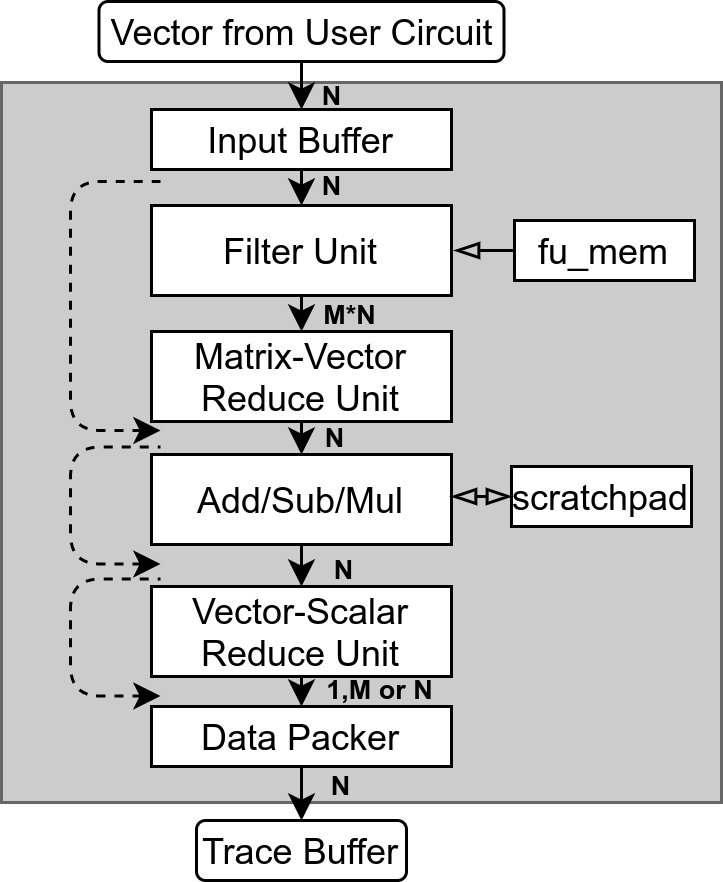

# Description of Hardware Blocks and Overall Flow

This first version of the documentation explains the basics of how to get started generating RTL instrumentation that can be emulated or simulated.

## Understanding how it works

#### Bulding Blocks

The debug processor can be composed out of the following building blocks:

- **Input Buffer** (N,IB_DEPTH)
  - **Description:** Stores IB_DEPTH tensors while other tensors are still being processed
  - **ISA instructions:** None
- **Filter Unit** (N,M,FUVRF_SIZE) 
  - **Description:** For each of the N elements received, output M elements. Each of those M elements is a binary indicator of wether the value is within a certain range. All ranges are stored in the fu_mem and the same range is applies to all elements of the input vector N.
  - **ISA instructions:** vv_filter(addr)
- **Matrix Vector Reduce** (N,M) 
  - **Description:** This block receives a N*M input and reduces the result either in the M or N axis. The only type of reduction that is currently made is the sum. This block is mandatory when the filter unit is instantiated.
  - **ISA instructions:** m_reduce(axis)
- **Vector Scalar Reduce** (N) 
  - **Description:** Reduce values along a given axis and output either 1, M or N values
  - **ISA instructions:** v_reduce
- **Vector Vector ALU** (N,VVVRF_SIZE) 
  - **Description:** Performs basic vector-vector operations and offers the option to store things in a scratchpad.
  - **ISA instructions:** vv_add(addr), vv_mul(addr), vv_sub(addr), v_cache(addr)
- **Data Packer** (N,M)
  - **Description:** Receives 1, N or M values and sends it to the trace buffer N at a time
  - **ISA instructions:** None
- **Trace Buffer** (N,TB_SIZE)
  - **Description:** Circular Trace Buffer
  - **ISA instructions:** None

#### Parameters

Every time that the we emulate the processor or create RTL for it, we have to define the following parameters:

- **N**: Input tensor width
- **M:** Number of binary ranges that will be avaluated by the filter unit (M<=N)
- **IB_DEPTH:** Number of tensors we can store in the input buffer
- **FUVRF_SIZE:** Number of different ranges we can have for the FIlter Unit (VRF size is FUVRF_SIZE*M)
- **VVVRF_SIZE:** Number of tensors we can store in the vector-vector scratchpad of the Filter Unit
- **TB_SIZE:** Number of tensors we can store in the trace buffer
- **DATA_WIDTH**: Input/output data width
- **MAX_CHAINS:** Maximum number of firmware chains the hardware is able to execute.

## Functions supported by both emulatedHw and rtlHw

- config()
  - Sets up run-time parameters including
    - Firmware
    - Memory initializations
- run()
  - Starts either simulation or emulation
  - Returns results from simulation/emulation
- compiler
  - Shoudl be able to handle all ISA instructions and compile() at the end

