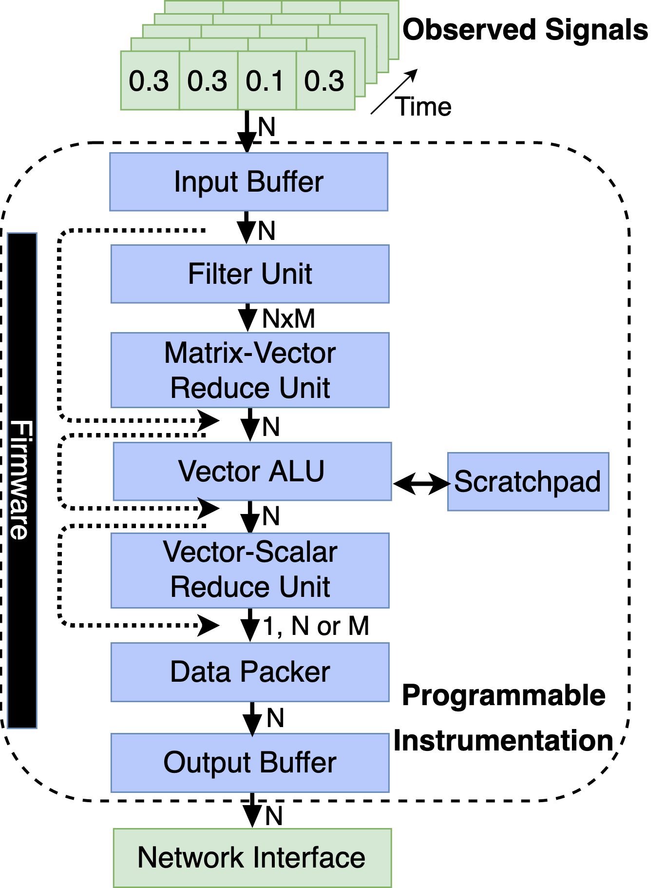

# Description of Hardware Blocks and Overall Flow

in order to understand how the firmware must be wirtten it is necessary to first understang the different building blocks that compose the hardware.

## Understanding how it works

#### Bulding Blocks

The debug processor can be composed out of the following building blocks:

- **Input Buffer** (N,IB_DEPTH)
  - **Description:** Stores IB_DEPTH tensors while other tensors are still being processed
  - **ISA instructions:** None
- **Filter Unit** (N,M,FUVRF_SIZE) 
  - **Description:** For each of the N elements received, output M elements. Each of those M elements is a binary indicator of wether the value is within a certain range. All ranges are stored in the fu_mem and the same range is applies to all elements of the input vector N.
  - **ISA instructions:** vv_filter(addr)
- **Matrix Vector Reduce** (N,M) 
  - **Description:** This block receives a N*M input and reduces the result either in the M or N axis. The only type of reduction that is currently made is the sum. This block is mandatory when the filter unit is instantiated.
  - **ISA instructions:** m_reduce(axis)
- **Vector Scalar Reduce** (N) 
  - **Description:** Reduce values along a given axis and output either 1, M or N values
  - **ISA instructions:** v_reduce()
- **Vector Vector ALU** (N,VVVRF_SIZE) 
  - **Description:** Performs basic vector-vector operations and offers the option to store things in a scratchpad.
  - **ISA instructions:** vv_add(addr), vv_mul(addr), vv_sub(addr), v_cache(addr),vv_max(addr)
- **Data Packer** (N,M)
  - **Description:** Receives 1, N or M values and sends it to the trace buffer N at a time
  - **ISA instructions:** None
- **Output Buffer** (N,TB_SIZE)
  - **Description:** Circular Trace Buffer used to store information while data is not transfered off-chip (network interface is not a part of this implementation and must be designed by the use based on the interface desired).
  - **ISA instructions:** None

#### Parameters

Every time that the we emulate the processor or create RTL for it, we have to define the following parameters:

- **N**: Input tensor width
- **M:** Number of binary ranges that will be avaluated by the filter unit (M<=N)
- **IB_DEPTH:** Number of tensors we can store in the input buffer
- **FUVRF_SIZE:** Number of different ranges we can have for the FIlter Unit (VRF size is FUVRF_SIZE*M)
- **VVVRF_SIZE:** Number of tensors we can store in the vector-vector scratchpad of the Filter Unit
- **TB_SIZE:** Number of tensors we can store in the trace buffer
- **DATA_WIDTH**: Input/output data width
- **MAX_CHAINS:** Maximum number of firmware chains the hardware is able to execute.
- **BUILDING_BLOCKS:** Order in which the building blocks will be connected.
- **DATA_TYPE**: Data type that we expect the user circuit to be using.
- **DEVICE_FAM:** FPGA device family we are targetting (not needed for emulation).

## Complete list of firmware instructions supported

The firmware instructions supported by the instrumentation is constantly evolving. For a complete list of the firmware instructions currently supported check out the [compiler source code](https://github.com/danielholanda/LeBug/blob/master/src/firmware/compiler.py).

